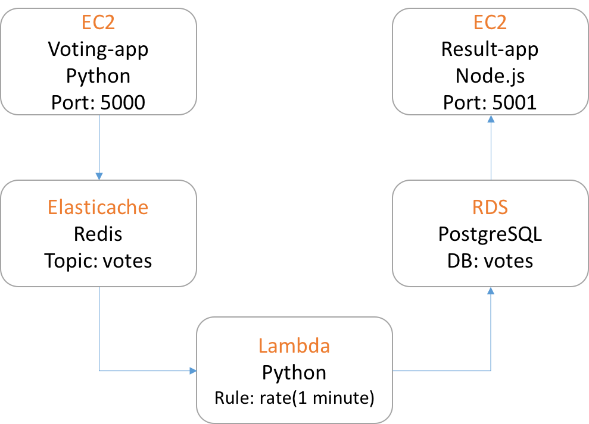

Cat VS Dog Voting App
=========
This repository contain the Terraform deployment implementation in **AWS** for the voting application
* Result part: [https://github.com/CYYG/catvsdog-result](https://github.com/CYYG/catvsdog-result)
* Vote part: [https://github.com/CYYG/catvsdog-vote](https://github.com/CYYG/catvsdog-vote)
* Lambda Worker: [https://github.com/CYYG/catvsdog-worker](https://github.com/CYYG/catvsdog-worker)
* Terraform: [https://github.com/ralbon/AWS-BBL-Infra](https://github.com/ralbon/AWS-BBL-Infra)

Getting started
---------------
## SET VARIABLES
Copy `aws_template.sh` with your own variables

## RUN Terraform
* `source aws_template0.sh`
* `./topology.sh {plan|apply|destroy} /your/repo`

Architecture
-----

* A Python webapp which lets you vote between two options
* A Redis queue which collects new votes
* A Python worker (designed for lambda) which consumes votes and stores them in…
* A Postgres database backed by a Docker volume
* A Node.js webapp which shows the results of the voting in real time

Note
----

The voting application only accepts one vote per client. It does not register votes if a vote has already been submitted from a client.
